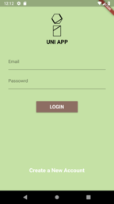
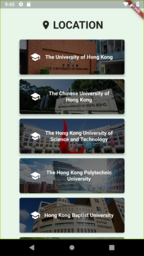
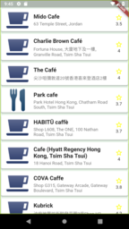
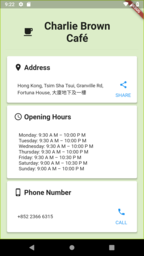
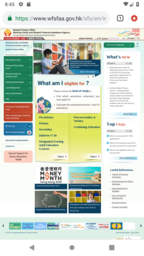

# Uni app

An app designed to help students in Hong Kong university student to accommodate their university life.

## Introduction

This app provides the information of university events, food, news, posts, jobs, useful links.

## Main Screen

## Event Screen

## Event Self Check-in

## Food Nearby

## Journal

## News

## Job Board

## Useful Links

